# Traffic Hand Signal Recognition Pipeline

📅 Written at 2024-10-04 13:39:17

## Pipeline Overview

```mermaid
graph TD
    FrameInput["📷 Frame Input"]
    PersonDetection["Ⓜ️ YOLOv11: Person Detection"]
    CropForPose["✂️ Crop for Pose/Hand Estimation"]
    PoseEstimation["Ⓜ️ Pose Estimation (Mediapipe Pose Landmark)"]
    HandLandmark["Ⓜ️ Hand Landmark Detection (Mediapipe Hand Landmark)"]
    PoseKeypoints["🦴 3D Keypoints Output"]
    HandKeypoints["✋ Hand Keypoints Output"]
    ActionRecognition["Ⓜ️ EfficientGCN: Action Recognition"]

    FrameInput --> PersonDetection
    PersonDetection --> CropForPose
    CropForPose --> PoseEstimation
    CropForPose --> HandLandmark
    PoseEstimation --> PoseKeypoints
    HandLandmark --> HandKeypoints
    PoseKeypoints --> ActionRecognition
    HandKeypoints --> ActionRecognition
```

## Why This Pipeline is Configured

In your project, the goal is to accurately recognize **traffic hand signals** while balancing **real-time performance** and **depth accuracy** using **resource-constrained hardware** (e.g., **Jetson Nano**). Here's a breakdown of the key points and reasons behind your pipeline choices:

---

### **1. Depth Consideration (3D vs. 2D)**

- **Initial Question**: You asked whether **3D depth** is required for gestures like **"Slow Down"** (pushing the palm toward the camera) or if **2D keypoints** would suffice. You considered that **elbow position** might change, which is critical for recognizing gestures.
- **Conclusion**: **Exact depth (z-axis)** is **important** for gestures that involve **forward-backward hand movements**, especially when the car is approaching the traffic controller or when there are **multiple controllers** present. You decided that **knowing exact depth measurements** can avoid ambiguities, especially in real-world scenarios where the vehicle's perspective and distance vary.

---

### **2. Cropping for Person and Hand Detection**

- **Pose and Hand Detection Integration**: You realized that while **cropping the bounding box** for each person detected by **YOLOv11** is necessary for ensuring **accurate pose detection** and **hand landmark detection**, it can affect **depth precision**. If not cropped, models might struggle with detecting hands at a **distance** or in the presence of **multiple people**.

- **Pose and Hand Model Misalignment**: You noted the importance of ensuring that **pose detection** and **hand detection** work together consistently. You chose to follow a **hierarchical processing** method:
  1. **Crop the person** for pose detection (RTMPose3D or Mediapipe Pose Landmark).
  2. **Further crop the hand region** using pose keypoints to focus the hand detection model.
  3. Ensure consistency between pose and hand detection, even at greater distances (like 4 meters).

---

### **3. Depth Accuracy vs. Real-Time Performance**

- **RTMPose3D** offers **higher depth accuracy** for 3D keypoints but is **more resource-intensive**, which can slow down the system on **Jetson Nano**.
- **Mediapipe Pose Landmark** offers approximate z-axis precision but is highly optimized for **real-time performance** on **edge devices** like **Jetson Nano**.

- **Conclusion**: Although **RTMPose3D** provides **better z-axis precision**, the **cropping of the bounding box** and the need for **real-time speed** make **Mediapipe Pose Landmark** a better fit. Its **depth approximation** is sufficient for traffic signal gestures, where **relative joint movements** are more important than exact depth.

---

### **4. Multiple Models and Resource Constraints**

- You are running several models in the pipeline:

  1. **YOLOv11** for person detection.
  2. **Pose detection** for body keypoints.
  3. **Mediapipe Hand Landmark** for hand keypoints.
  4. **EfficientGCN** for action recognition.

- **Real-Time Performance**: **Jetson Nano** has limited computational power, and running four models requires a balance between accuracy and speed. You opted for **Mediapipe Pose Landmark** over **RTMPose3D** to ensure the pipeline can maintain **real-time performance**.

---

### **5. Action Recognition: MS-G3D vs. EfficientGCN**

- **EfficientGCN** was selected over **MS-G3D** due to the need for balancing **accuracy and performance**. EfficientGCN provides comparable accuracy to MS-G3D but with significantly lower computational resource usage, making it a better fit for real-time applications on edge devices.

---

### **Final Pipeline Configuration: Why These Models Were Chosen**

1. **Object Detection (YOLOv11)**:

   - **Why YOLOv11**: Efficient for detecting people, with support for multiple classes and high performance. Better than **Mediapipe Object Detection** for your case, as it can focus specifically on people and is highly optimized for embedded systems.

2. **Pose Detection (Mediapipe Pose Landmark)**:

   - **Why Mediapipe Pose Landmark**: Provides good-enough z-axis approximation for 3D pose estimation while maintaining **real-time speed** on Jetson Nano. Depth precision is sufficient for your project, and the model is lightweight compared to RTMPose3D.

3. **Hand Detection (Mediapipe Hand Landmark)**:

   - **Why Mediapipe Hand Landmark**: It seamlessly integrates with **Mediapipe Pose**, ensuring consistent detection of hands and poses, especially in real-time applications.

4. **Action Recognition (EfficientGCN)**:
   - **Why EfficientGCN**: Chosen due to its ability to handle **complex, multi-part gestures** in traffic signals by analyzing spatial and temporal changes in **skeleton-based action recognition** while being computationally efficient.

---

## Benchmarks and Performance Comparisons

### **MS-G3D (2020)**

- **mAP**: 87%-90% on the NTU-RGB+D dataset.
- **FPS**: 8-15 FPS, depending on hardware.
- **Strength**: High accuracy due to multi-scale graph convolutions for spatial and temporal relationships.
- **Resource Usage**: Higher GPU memory and compute power needed.
- **Improvements**: Solves effective temporal modeling issues.

### **EfficientGCN (2021)**

- **mAP**: 84%-87% on the NTU-RGB+D dataset.
- **FPS**: 20-30 FPS, optimized for edge devices.
- **Strength**: Balanced accuracy and efficiency.
- **Resource Usage**: Lower memory and computation requirements, more suitable for real-time applications.
- **Improvements**: Reduces overhead while maintaining accuracy.

### **ST-GCN (2018)**

- **mAP**: 81%-85% on the NTU-RGB+D dataset.
- **FPS**: 10-15 FPS.
- **Strength**: Introduced spatial-temporal graph convolutions for skeleton sequences.
- **Resource Usage**: Lower computational cost but less accuracy for complex actions.
- **Improvements**: Improved action recognition with graph-based modeling.

---

## References

- MS-G3D: https://ar5iv.labs.arxiv.org/html/2106.15125
- EfficientGCN: https://deepai.org/publication/constructing-stronger-and-faster-baselines-for-skeleton-based-action-recognition

EfficientGCNv1
https://github.com/zyxjtu/EfficientGCNv1
ACMMM 2020 ; https://dl.acm.org/doi/abs/10.1145/3394171.3413802
Arxiv Preprint ; https://arxiv.org/pdf/2010.09978.pdf

EfficientGCN 2
https://github.com/attention-eq-everything/effgcn_cam
IEEE T-PAMI; https://ieeexplore.ieee.org/abstract/document/9729609
Arxiv Preprint ; https://arxiv.org/pdf/2106.15125
