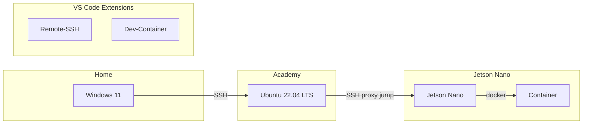
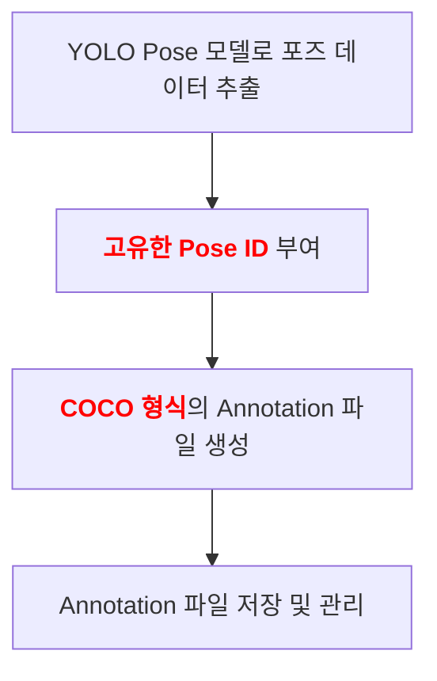

# Remote Development Workflow

```mermaid
flowchart LR
    subgraph Home
        Windows["Windows 11"]
    end

    subgraph Academy
        U["Ubuntu 22.04 LTS"]
    end
    
    subgraph Jetson Nano
        J["Jetson Nano"]
        Jc["Container"]
    end

    Windows -->|SSH| U
    U -->|SSH proxy jump| J
    J -->|docker| Jc


    subgraph VS Code Extensions
        Remote-SSH
        Dev-Container
    end


```

```mermaid
flowchart TD
    A[YOLO Pose 모델로 포즈 데이터 추출] --> B["<span style='color:red; font-weight:bold;'>고유한 Pose ID</span> 부여"]
    B --> C["<span style='color:red; font-weight:bold;'>COCO 형식</span>의 Annotation 파일 생성"]
    C --> D[Annotation 파일 저장 및 관리]

```
