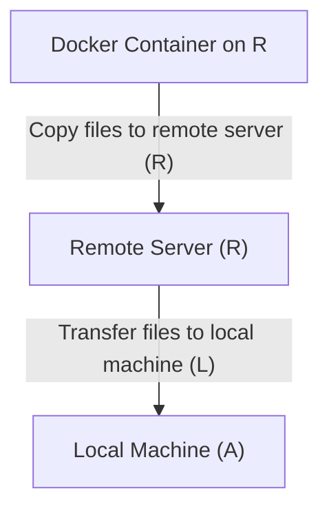

# Snippets

## 🧮 Snippet: `container_host_file_transfer.sh`  

📅 **2024-10-22 00:49:14**

This script handles the **transfer of files across multiple environments**:  
A (Local Machine) → B (Remote Server) → B (Remote Server's Docker Container).

---

### 🧭 Overview

#### **Structure:**



#### **Use Case Example:**

- **Model Export and Optimization**:  
  Inside a **Docker container on the remote server (R)** (e.g., an **Ultralytics (YOLO) container** with CUDA enabled for Jetson Nano), models are converted to **TensorRT format**.  
  The models are further optimized to **half-precision** (FP16) to improve performance and reduce memory usage on edge devices.  
  Once the conversion and optimization are complete, the **exported models** are transferred from the **remote server (R)** to the **local machine (A)** for further testing, development, or deployment to other environments.

### 📜 Bash Script

```bash
#!/bin/bash

# 🗂️ Define variables for container names, paths, and filenames
CONTAINER_NAME="cranky_elgamal"  # Docker container name
DOCKER_CONTAINER_PATH="/ultralytics"  # Path inside the Docker container
LOCAL_REPO_PATH="$HOME/repos/signal-masters/ml/models/from_ultralytics_container"  # Local path to store copied files
ENGINE_FILENAME="yolo11n-pose.engine"  # Engine model filename (example)
ONNX_FILENAME="yolo11n-pose.onnx"  # ONNX model filename (example)

# 🌐 Define variables for remote server connection
DESTINATION_USER="wbfw109v2"  # Remote server's username
DESTINATION_HOST="10.10.16.154"  # Remote server's IP address or hostname
DESTINATION_PATH="/home/$DESTINATION_USER/repo/synergy-hub/prototypes/_initialization/devcontainers/jetson_nano-mount/signal-masters/ml/models/from_ultralytics_container"  # Remote path on the server

# 🐋 Step 1: Copy ONNX model from Docker container to the local directory with '_half' suffix
docker cp "$CONTAINER_NAME:$DOCKER_CONTAINER_PATH/$ONNX_FILENAME" \
  "$LOCAL_REPO_PATH/${ONNX_FILENAME%.*}_half.onnx"

# 🐋 Step 2: Copy engine model from Docker container to the local directory with '_half' suffix
docker cp "$CONTAINER_NAME:$DOCKER_CONTAINER_PATH/$ENGINE_FILENAME" \
  "$LOCAL_REPO_PATH/${ENGINE_FILENAME%.*}_half.engine"

# 🚀 Step 3: Transfer local files to the remote server using SCP
# This will copy all files and subdirectories from the local path to the remote destination path.
scp -r $LOCAL_REPO_PATH/* "$DESTINATION_USER@$DESTINATION_HOST:$DESTINATION_PATH/"

# 📝 Notes:
# 1. Ensure SSH access is configured for the remote server (B).
# 2. The script assumes that the Docker container on the local machine (A) is running and accessible.
# 3. This script can be adjusted for different filenames or paths as required.
# 4. If further processing inside B's Docker container is required, you can use `docker exec` or `docker cp` on the remote server.
