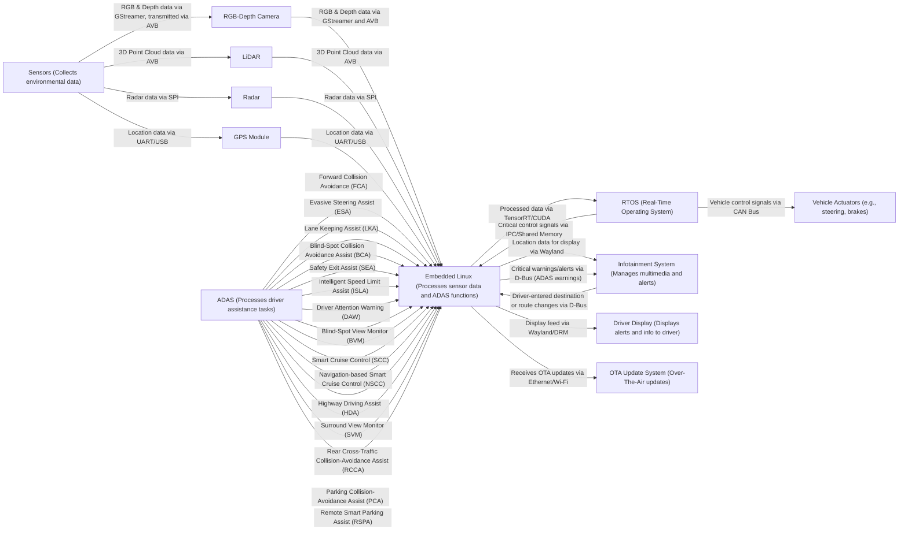

```mermaid
graph LR

    %% Sensors group definition (All sensors with communication/protocols) %%
    Sensors["Sensors (Collects environmental data)"]
    RGBDepthCamera["RGB-Depth Camera"]
    LiDAR["LiDAR"]
    Radar["Radar"]
    GPS["GPS Module"]
    
    EmbeddedLinux["Embedded Linux (Processes sensor data and ADAS functions)"]
    ADAS["ADAS (Processes driver assistance tasks)"]
    RTOS["RTOS (Real-Time Operating System)"]
    Actuators["Vehicle Actuators (e.g., steering, brakes)"]

    Infotainment["Infotainment System (Manages multimedia and alerts)"]
    DriverDisplay["Driver Display (Displays alerts and info to driver)"]
    OTA["OTA Update System (Over-The-Air updates)"]

    %% Data flow from Sensors to Embedded Linux %%
    Sensors -->|"RGB & Depth data via GStreamer, transmitted via AVB"| RGBDepthCamera
    Sensors -->|"3D Point Cloud data via AVB"| LiDAR
    Sensors -->|"Radar data via SPI"| Radar
    Sensors -->|"Location data via UART/USB"| GPS
    RGBDepthCamera -->|"RGB & Depth data via GStreamer and AVB"| EmbeddedLinux
    LiDAR -->|"3D Point Cloud data via AVB"| EmbeddedLinux
    Radar -->|"Radar data via SPI"| EmbeddedLinux
    GPS -->|"Location data via UART/USB"| EmbeddedLinux

    %% ADAS system definition and data flow %%
    ADAS -->|"Forward Collision Avoidance (FCA)"| EmbeddedLinux
    ADAS -->|"Evasive Steering Assist (ESA)"| EmbeddedLinux
    ADAS -->|"Lane Keeping Assist (LKA)"| EmbeddedLinux
    ADAS -->|"Blind-Spot Collision Avoidance Assist (BCA)"| EmbeddedLinux
    ADAS -->|"Safety Exit Assist (SEA)"| EmbeddedLinux
    ADAS -->|"Intelligent Speed Limit Assist (ISLA)"| EmbeddedLinux
    ADAS -->|"Driver Attention Warning (DAW)"| EmbeddedLinux
    ADAS -->|"Blind-Spot View Monitor (BVM)"| EmbeddedLinux
    ADAS -->|"Smart Cruise Control (SCC)"| EmbeddedLinux
    ADAS -->|"Navigation-based Smart Cruise Control (NSCC)"| EmbeddedLinux
    ADAS -->|"Highway Driving Assist (HDA)"| EmbeddedLinux
    ADAS -->|"Surround View Monitor (SVM)"| EmbeddedLinux
    ADAS -->|"Rear Cross-Traffic Collision-Avoidance Assist (RCCA)"| EmbeddedLinux
    ADAS -->|"Parking Collision-Avoidance Assist (PCA)"| EmbeddedLinux
    ADAS -->|"Remote Smart Parking Assist (RSPA)"| EmbeddedLinux

    %% Data flow between RTOS and Vehicle Systems %%
    RTOS -->|"Critical control signals via IPC/Shared Memory"| EmbeddedLinux
    RTOS -->|"Vehicle control signals via CAN Bus"| Actuators

    %% Direct Connections (with protocols and communication methods) %%
    EmbeddedLinux -->|"Processed data via TensorRT/CUDA"| RTOS
    EmbeddedLinux -->|"Display feed via Wayland/DRM"| DriverDisplay
    EmbeddedLinux -->|"Location data for display via Wayland"| Infotainment
    Infotainment -->|"Driver-entered destination or route changes via D-Bus"| EmbeddedLinux
    EmbeddedLinux -->|"Critical warnings/alerts via D-Bus (ADAS warnings)"| Infotainment

    %% External Systems %%
    EmbeddedLinux -->|"Receives OTA updates via Ethernet/Wi-Fi"| OTA

```
