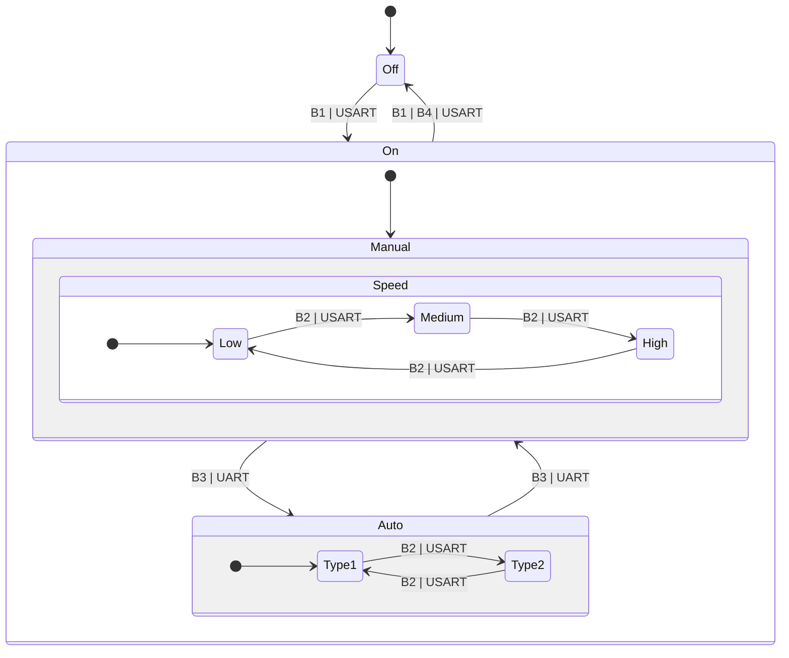

# Fan Project

📅 Written at 2025-01-03 09:44:20

- [Fan Project](#fan-project)
  - [Project Introduction](#project-introduction)
    - [Features](#features)
    - [🎯 Purposes](#-purposes)
    - [🖼️ Hardware Setup](#️-hardware-setup)
      - [Breadboard Setup](#breadboard-setup)
    - [🎥 Fan Machine Demo](#-fan-machine-demo)
  - [🌐 Project Overview](#-project-overview)
    - [FSM (Finite State Machine)](#fsm-finite-state-machine)
      - [🕹️ Inputs (Button Definitions)](#️-inputs-button-definitions)
      - [📊 Diagram](#-diagram)
    - [🛠️ Tools](#️-tools)
      - [🧑‍💻 Software](#-software)
      - [🖥️ Hardware](#️-hardware)
    - [📁 Directory Structure](#-directory-structure)
    - [📖 Design Patterns and Benefits](#-design-patterns-and-benefits)
      - [Layer Overview](#layer-overview)
      - [Applied Design Pattern](#applied-design-pattern)
      - [❗ Advantages of MVP + Service Pattern](#-advantages-of-mvp--service-pattern)
  - [Retrospective](#retrospective)
    - [📌 Key Learnings and Improvements](#-key-learnings-and-improvements)

## Project Introduction

### Features

- 전원 제어: 선풍기 전원을 켜거나 끌 수 있음.
- 팬 속도 조절: 저속, 중속, 고속으로 팬 속도를 변경 가능.
- 모드 전환: 수동 모드와 자동 모드 간 전환 가능.
- 타이머 설정: 3, 5, 7분 타이머 설정으로 자동 종료.
- 상태 표시: LCD 및 FND로 현재 모드, 속도, 타이머 상태 표시.

### 🎯 Purposes

- **C 언어 코드 모듈화 및 구조화**

  - 명확한 디렉터리 구조 설계 (`app` -> `peripheral` (device) -> `driver`)
  - 구조체와 함수 포인터를 활용하여 객체지향적 설계 구현
  - 코드 일관성을 위한 명명 규칙(Naming Convention) 설정
  - 재사용성을 고려한 Utility 라이브러리 제작

- **디자인 패턴 학습 및 활용**

  - 🪱 Model-View-Presenter (MVP) + Service 패턴을 적용하여 시스템의 모듈화와 유지보수성을 강화
  - 구조적 설계를 통해 코드 재사용성 및 확장성 증대

- **외부 장치 제어 기술 숙련**

  - LCD, Buzzer, FND, Motor 등 다양한 장치를 제어하며 하드웨어와 소프트웨어 통합 기술 향상
  - UART 통신 프로토콜 이해 및 구현을 통한 장치 간 데이터 교환 학습
  - FND 디스플레이를 통해 출력 데이터를 시각적으로 표현하는 기술 학습

- **데이터 구조와 알고리즘 학습**

  - UART 수신 데이터 처리에서 🪱 원형 큐(Circular Queue)를 활용하여 **메모리 효율성**, **데이터 흐름 관리** 향상 및 **데이터 손실 방지**

- **데이터시트 분석 능력 향상**
  - 데이터시트를 기반으로 장치 특성을 파악하고 이를 구현에 반영하는 기술 강화

### 🖼️ Hardware Setup

#### Breadboard Setup


---

### 🎥 Fan Machine Demo

[](https://youtu.be/hGNbbrZe-AM "Watch on YouTube")

_Click on the image above to watch the full demo on [YouTube](https://youtu.be/hGNbbrZe-AM)._

---

## 🌐 Project Overview

### FSM (Finite State Machine)

📝 **참고**: 명시적인 전환이 정의되지 않는 한 상태는 변경되지 않음.

#### 🕹️ Inputs (Button Definitions)

| **버튼** | **기능**                                  |
| -------- | ----------------------------------------- |
| **B1**   | 시스템 전원 토글 (켜기/끄기)              |
| **B2**   | 팬 속도 조정 (수동 또는 자동 모드)        |
| **B3**   | 자동 모드와 수동 모드 간 토글 (진입 지점) |
| **B4**   | 종료 타이머 설정 (없음, 3분, 5분, 7분)    |

---

#### 📊 Diagram



### 🛠️ Tools

#### 🧑‍💻 Software

- **IDE**: Microchip Studio
- **Programming Language**: C

#### 🖥️ Hardware

- **Processor**: AVR Atmega128/A (RISC) (1 EM)
- **LCD Module**: TC1602A-01T (1 EM)
- **Button (Pull-up Circuit)**: CL5642AH30 (4 EM)
- **FND (Common-Cathode Type)**: - (1 EM)
- **Buzzer**: - (1 EM)
- **Motor**: - (1 EM)

---

### 📁 Directory Structure

├── 📂 **app**  
│&nbsp;&nbsp;&nbsp;&nbsp;└── 📂 **fanMachine**  
│&nbsp;&nbsp;&nbsp;&nbsp;&nbsp;&nbsp;&nbsp;&nbsp;├── [fanMachinApp.c](app/fanMachine/fanMachinApp.c)  
│&nbsp;&nbsp;&nbsp;&nbsp;&nbsp;&nbsp;&nbsp;&nbsp;├── 📂 listener  
│&nbsp;&nbsp;&nbsp;&nbsp;&nbsp;&nbsp;&nbsp;&nbsp;│&nbsp;&nbsp;&nbsp;&nbsp;└── [fanListener.c](app/fanMachine/listener/fanListener.c)  
│&nbsp;&nbsp;&nbsp;&nbsp;&nbsp;&nbsp;&nbsp;&nbsp;├── 📂 model  
│&nbsp;&nbsp;&nbsp;&nbsp;&nbsp;&nbsp;&nbsp;&nbsp;│&nbsp;&nbsp;&nbsp;&nbsp;└── [fanModel.c](app/fanMachine/model/fanModel.c)  
│&nbsp;&nbsp;&nbsp;&nbsp;&nbsp;&nbsp;&nbsp;&nbsp;├── 📂 presenter  
│&nbsp;&nbsp;&nbsp;&nbsp;&nbsp;&nbsp;&nbsp;&nbsp;│&nbsp;&nbsp;&nbsp;&nbsp;└── [fanPresenter.c](app/fanMachine/presenter/fanPresenter.c)  
│&nbsp;&nbsp;&nbsp;&nbsp;&nbsp;&nbsp;&nbsp;&nbsp;└── 📂 service  
│&nbsp;&nbsp;&nbsp;&nbsp;&nbsp;&nbsp;&nbsp;&nbsp;&nbsp;&nbsp;&nbsp;&nbsp;└── [fanService.c](app/fanMachine/service/fanService.c)  
├── 📂 **driver**  
│&nbsp;&nbsp;&nbsp;&nbsp;├── 📂 [gpio](driver/gpio/gpio.h)  
│&nbsp;&nbsp;&nbsp;&nbsp;├── 📂 [pwm](driver/pwm/pwm.h)  
│&nbsp;&nbsp;&nbsp;&nbsp;├── 📂 [timer](driver/timer/timer.h)  
│&nbsp;&nbsp;&nbsp;&nbsp;└── 📂 [uart](driver/uart/uart.h)  
├── [main.c](main.c)  
├── 📂 **peripheral**  
│&nbsp;&nbsp;&nbsp;&nbsp;├── 📂 [button](peripheral/button/button.h)  
│&nbsp;&nbsp;&nbsp;&nbsp;├── 📂 [buzzer](peripheral/buzzer/buzzer.h)  
│&nbsp;&nbsp;&nbsp;&nbsp;├── 📂 [fnd](peripheral/fnd/fnd.h)  
│&nbsp;&nbsp;&nbsp;&nbsp;├── 📂 [lcd](peripheral/lcd/lcd.h)  
│&nbsp;&nbsp;&nbsp;&nbsp;└── 📂 [motor](peripheral/motor/motor.h)  
├── 📂 **resource**  
│&nbsp;&nbsp;&nbsp;&nbsp;├── [fan_machine-breadboard_setup.jpg](resource/fan_machine-breadboard_setup.jpg)  
└── 📂 **utility**  
&nbsp;&nbsp;&nbsp;&nbsp;├── [bitmask.h](utility/bitmask.h)  
&nbsp;&nbsp;&nbsp;&nbsp;├── [boolean.h](utility/boolean.h)  
&nbsp;&nbsp;&nbsp;&nbsp;└── [clockTimer.h](utility/clockTimer.h)

---

### 📖 Design Patterns and Benefits

#### Layer Overview

| Layer             | Description                                                   | Matching Directory                              |
| ----------------- | ------------------------------------------------------------- | ----------------------------------------------- |
| Application Layer | 사용자 어플리케이션 로직. 장치와 시스템 흐름 제어             | `app/`                                          |
| OS/RTOS           | 운영 체제 또는 실시간 OS (Optional).                          | `<None>`                                        |
| Devices Layer     | 외부 장치 관리 (모터, 버저, 버튼, LCD, FND)                   | `peripheral/` (motor, buzzer, button, lcd, fnd) |
| HAL/Drivers       | 하드웨어 초기화 및 MCU 주변 장치 제어 (GPIO, 타이머, UART 등) | `driver/` (gpio, timer, uart, pwm)              |
| Hardware          | 물리적 하드웨어 (MCU, 센서 등)                                | AVR Atmega128/A, TC1602A-01T, etc.              |

#### Applied Design Pattern

`app/fanMachine` 디렉터리에서 **모델-뷰-프레젠터(MVP) + 서비스** 패턴을 사용하여 애플리케이션 로직을 구조화하고 조직화.

1. **모델 (`model/`)**:

   - 팬의 상태와 데이터(예: 속도, 제어 모드, 종료 타이머)를 캡슐화.
   - 내부 상태를 관리하기 위한 getter 및 setter 메서드를 제공.
   - 예:
     ```c
     uint8_t getFanSpeedState() {
         return _fanSpeedState;
     }
     void setFanSpeedState(uint8_t fanSpeedState) {
         _fanSpeedState = fanSpeedState;
     }
     ```
   - **책임**: 중앙 집중식 상태 관리.

2. **뷰 (`listener/`)**:

   - 사용자 입력(예: 버튼 누름, UART 명령)을 모니터링하고 `Presenter`에 변경 사항을 알림.
   - 외부 상호작용을 위한 이벤트 리스너 역할.
   - 예:
     ```c
     static void _fanListener_checkButtonEvent() {
         switch (releasedBtnPinNum) {
             case BUTTON_FAN_SPEED_PIN_NUM:
                 setFanSpeedStateToNext();
                 break;
             case BUTTON_FAN_CONTROL_MODE_PIN_NUM:
                 setFanControlModeStateNext();
                 break;
         }
     }
     ```
   - **책임**: 사용자 입력을 감지하고 모델의 상태값을 업데이트.

3. **프레젠터 (`presenter/`)**:

   - `모델`과 `뷰` 간의 통신을 조정.
   - 사용자 입력 또는 시스템 이벤트에 따라 `모델`을 업데이트하고 표시할 데이터를 준비.
   - 예:
     ```c
     void fanPresenter_displaytoLcd(uint8_t minute, uint8_t second) {
         char buff[30];
         sprintf(buff, "%02d:%02d", minute, second);
         lcd.writeLcdStringToXy(&lcd, buff, 1, 2);
     }
     ```
   - **책임**: 서비스로부터 받은 데이터를 뷰에 전달하여 사용자에게 표시.

4. **서비스 (`service/`)**:
   - 타이머 관리, 모터 속도 제어, UART 통신 등의 재사용 가능한 로직을 캡슐화.
   - 자동 모드 순환 및 종료 타이머 처리와 같은 고급 기능을 제공.
   - 예:
     ```c
     void _fanService_updateByCurrentState() {
         if (fanControlModeState == FAN_CONTROL_MODE_AUTO && fanControlAutoModeTimer.second >= fanControlModeAutoCycleSecond) {
             uint16_t randomDutyCycle = (rand() % 10 + 1) * 10;
             motor.setFanSpeed(&motor, randomDutyCycle);
         }
     }
     ```
   - **책임**: 핵심 재사용 로직 및 고급 기능. 모델의 상태값을 주기적으로 확인하고 로직을 처리하여 프레젠터로 전달

---

#### ❗ Advantages of MVP + Service Pattern

1. **관심사의 분리**:

   - 각 구성 요소(모델, 뷰, 프레젠터, 서비스)는 명확한 책임을 가지며 복잡성을 줄임.

2. **모듈성**:

   - 독립적인 구성 요소는 새로운 기능 추가 또는 개별 계층 교체를 쉽게 만듦.

3. **테스트 가능성**:

   - `서비스` 계층의 핵심 로직과 `모델` 계층의 상태 관리는 독립적으로 테스트 가능.

4. **재사용성**:

   - `fanService`와 같은 서비스는 유사한 애플리케이션 또는 기계에서 재사용 가능.

5. **확장성**:
   - 추가 팬 모드 또는 고급 타이머와 같은 새로운 기능 추가가 계층형 아키텍처 덕분에 간단.

---

## Retrospective

### 📌 Key Learnings and Improvements

1. **하드웨어 문서화**

   ➡️ 하드웨어 모델에 대한 포괄적인 문서 작성, **데이터시트 링크 포함**, 팀의 접근성과 이해를 향상시키는 작업.

   - 하드웨어 모델과 그 사양이 잘 문서화되어 있는지 확인하는 작업.

2. **디렉터리 명명 규칙**

   ➡️ 향후 프로젝트에서 일관적이고 표준화된 용어 사용으로 명확성을 개선하는 작업.

   - 이 프로젝트에서 "peripheral"이라는 디렉터리 이름이 사용되었으나, 임베디드 시스템에서 종종 하드웨어 레지스터를 의미하기 때문에 혼란을 초래함.
   - 향후 프로젝트에서는 ❗ **"device"**와 같은 더 표준적이고 널리 사용되는 용어를 채택해야 함.
     - 예시 (Wiktionary 참조):
       - [Device](https://en.wiktionary.org/wiki/device): 주변 장치; 하드웨어 항목.
       - [Peripheral Device](https://en.wiktionary.org/wiki/peripheral_device#English): 컴퓨터에서 사용하는 외부 전자 장치.

3. **C에서의 OOP 개념을 위한 명명 규칙**

   ➡️ 임베디드 시스템에서 산업 표준 명명 규칙을 조사하여 모범 사례를 확보하는 작업.

   - C에서 OOP 원칙을 따르려는 시도는 특히 구조체의 캡슐화 부족으로 인해 어려움이 있었음.
   - 🚣 모듈 이름(PascalCase)을 함수 이름(camelCase)에 접두어로 붙여 OOP 구조를 모방하는 명명 규칙 채택.
   - 예시:
     ```c
     static void _Fnd_setFndNum(fnd_t* fnd, uint16_t value) {
         fnd->value = value;
     }
     ```

4. **FSM 설계 과제**

   ➡️ 기능을 유지하면서 FSM 설계를 더욱 간단하게 만들 대안을 탐색하는 작업.

   - 초기 FSM 설계는 지나치게 복잡하고 관리하기 어려웠음(참조: [이전 FSM 다이어그램](resource/previous_FSM.png)).
   - 설계를 재평가한 후, 더 **직관적이고 단순한 구조**가 가능함이 드러남.
   - **교훈**: 구현 전에 더 많은 시간을 들여 신중하게 설계하는 작업. 개선되고 간결한 FSM은 🔗 "\[FSM \(Finite State Machine\)\]"에서 참조 가능.

5. **인터럽트 처리와 디스플레이 효율 개선**

   - FND 디스플레이 효율성과 관련하여 원자성 문제 및 불필요한 계산과 같은 이슈가 발생함.
   - 💡 **인터럽트 내부에서의 계산 최소화** 및 복잡한 계산이 필요한 경우 간격을 늘려 다른 시간에 민감한 작업과의 간섭을 방지하는 작업.

---
