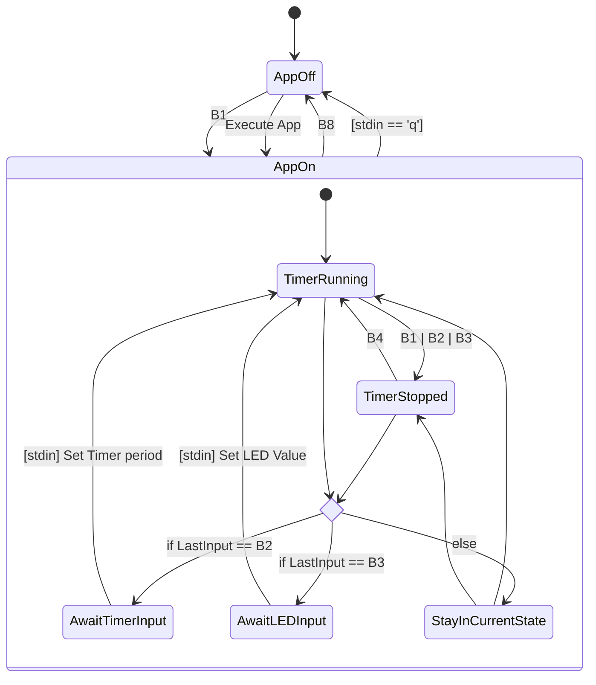

# Fan Project

📅 Written at 2025-01-03 09:44:20

- [Fan Project](#fan-project)
  - [Project Introduction](#project-introduction)
    - [Features](#features)
    - [🎯 Purposes](#-purposes)
    - [🎥 Kernel Timer Demo](#-kernel-timer-demo)
  - [🌐 Project Overview](#-project-overview)
    - [FSM (Finite State Machine)](#fsm-finite-state-machine)
      - [🕹️ Inputs](#️-inputs)
      - [📊 Diagram](#-diagram)
    - [🛠️ Tools](#️-tools)
      - [🧑‍💻 Software](#-software)
        - [Setup](#setup)
      - [🖥️ Hardware](#️-hardware)
        - [GPIO Pinout Table](#gpio-pinout-table)
    - [📁 Directory Structure](#-directory-structure)
  - [Retrospective](#retrospective)
    - [📌 Key Learnings and Improvements](#-key-learnings-and-improvements)

## Project Introduction

- 타이머 기반 LED **제어 응용 프로그램** 및 **디바이스 드라이버**

  - 타이머 주기마다 LED가 반전되는 프로그램으로, 버튼 입력 및 키보드(stdin)를 통해 LED 상태와 타이머 주기를 유연하게 설정 가능

### Features

- 버튼(Key) 입력과 사용자 stdin을 활용한 응용 애플리케이션 제어 기능 포함.
  -Poll 및 Blocking I/O 방식을 기반으로,

- 장치 등록
  이 드라이버는 **캐릭터 디바이스**로 등록되어, `register_chrdev()`를 통해 장치 파일을 생성하고, 사용자 공간 애플리케이션에서 이 장치 파일을 통해 I/O 작업을 수행할 수 있도록 합니다. 이를 통해 장치가 커널과 연결되고, 사용자 공간에서 접근할 수 있습니다.

- LED 반전 제어
  주기적으로 **LED**가 켜짐/꺼짐을 반복하며, 사용자가 지정한 **LED 패턴(값)**에 맞춰 타이머 이벤트를 처리합니다.

- 버튼 입력 처리
  하드웨어 버튼(Key)이 눌리면 **인터럽트**가 발생하여, `keyIsr()` 함수가 호출됩니다. 이 함수는 버튼 입력에 대응하여 타이머 시작/중지, LED 패턴 변경 등 다양한 동작을 수행합니다. 인터럽트가 발생하면 바로 해당 키 번호에 맞춰 적절한 처리가 이루어집니다.

- stdin을 통한 제어
  표준 입력(`stdin`)을 통해서도 타이머 주기를 수정하거나 LED 값을 변경하고, 응용 프로그램을 종료하는 등의 추가적인 입력 제어가 가능합니다. 예를 들어, `q` 또는 `Q`를 입력하여 응용 프로그램을 종료할 수 있습니다.

- Poll & Blocking I/O
  버튼 입력이 없을 때는 프로세스를 **Sleep** 상태로 두고, 키 인터럽트가 발생하면 `wake_up` 메커니즘을 통해 처리하도록 설계되어 있습니다. 현재 드라이버는 `poll()`을 사용하여 **비동기적으로 키 입력 이벤트**를 감지하고 처리하고 있습니다. 이 방식은 **블로킹 I/O**와 비교해 효율성을 높이는 데 유리하며, I/O가 발생할 때까지 대기하는 방식입니다. `poll()`은 키 입력을 비동기적으로 처리하여, 프로그램이 다른 작업을 수행하면서도 키 이벤트를 감지할 수 있게 합니다.

- 파일 작업 함수 정의
  `struct file_operations` 구조체를 사용하여 장치 파일에 대한 다양한 작업을 정의했습니다. 이 함수들에는 `open()`, `read()`, `write()`, `poll()`, `release()` 등의 함수가 포함되어 있으며, 이를 통해 장치 파일을 여는 것부터 데이터 읽기/쓰기, 키 입력 이벤트 처리 등 다양한 I/O 작업을 지원합니다.

- IOCTL 제어
  타이머 시작/중지(`TIMER_START`, `TIMER_STOP`) 및 타이머 주기 설정(`TIMER_VALUE`)을 `ioctl()` 인터페이스로 처리하여, 사용자 공간에서 간편하게 커널 타이머를 관리할 수 있습니다. 이를 통해 커널 모듈의 동작을 제어할 수 있는 기능을 제공합니다.

- 동기화
  이 드라이버는 **인터럽트** 서비스 루틴에서 발생할 수 있는 경쟁 조건을 방지하기 위해 **`mutex`**를 사용하여 동기화합니다. 하드웨어 버튼의 입력을 처리하는 `keyIsr()` 함수에서 `keyMutex`를 사용하여 버튼 번호(`keyNum`)를 안전하게 수정합니다. 여러 인터럽트가 동시에 발생하는 경우, `mutex_trylock()`을 사용하여 하나의 인터럽트만 처리하도록 보장하며, 이로써 다중 ISR 간의 충돌을 방지합니다. 이를 통해 LED 상태 변경이나 타이머 설정과 같은 중요한 작업이 동기화되며, 다른 프로세스나 스레드가 간섭하지 않도록 보호됩니다.

- 동적 메모리 할당과 해제
  장치가 열릴 때마다 `keyDataStruct` 구조체를 할당하여, 각 버튼에 대한 IRQ 번호와 키 번호를 저장할 필요가 있습니다. 이 구조체는 각 장치 인스턴스에 대해 별도의 데이터를 저장해야 하기 때문에, **동적 메모리 할당**이 필요합니다.

  `kmalloc()`은 커널에서 **동적 메모리 할당**을 위한 함수로, 장치가 열릴 때마다 새로운 메모리 블록을 할당하여, 각 `file_operations`가 독립적으로 **개별적인 상태**를 유지할 수 있도록 합니다. 특히 이 드라이버에서는 각 장치에 대해 별도의 **버튼 정보**(`keyDataStruct`)와 **IRQ 번호**가 필요하기 때문에, 이를 저장할 메모리가 **동적으로 할당**됩니다. `kmalloc()`을 사용하지 않으면 여러 인스턴스가 동일한 데이터를 공유하게 되어, 장치 간에 데이터 충돌이나 예기치 않은 동작을 초래할 수 있습니다.

  또한, 메모리 할당이 실패할 경우, `kmalloc()`은 `NULL`을 반환하며, 이 경우 드라이버가 적절히 처리할 수 있도록 `-ENOMEM` 오류를 반환합니다. 이렇게 하면 커널이 안정적으로 동작할 수 있도록 보장됩니다.

  장치가 닫히거나 더 이상 필요하지 않을 때, `kfree()`를 사용하여 할당한 메모리를 해제합니다. 이 메모리 해제는 `ledkey_release()` 함수에서 수행되며, **메모리 누수**를 방지하는 중요한 역할을 합니다. `kfree()`를 사용하여 동적으로 할당한 메모리를 해제함으로써, 커널 모듈이 종료될 때 시스템 자원을 효율적으로 반환할 수 있습니다.

### 🎯 Purposes

TODO:

- llvm stack clang 사용하여 크로스컴파일.
- Makefile 을 추상화?구조화? (뭐라고하지 용어?) Makefile 에서 하위 app/Makefile, module/Makefile 을 호출하여 관심사 분리? 뭐라고 해야하나 이름을? 나는 "위임 한다고 했음." build, deploy, clean 별로 Rule? Target 을 나누고, 각각에 대해 -app, -module 을 suffix 로 붙여 호출할 수 있게 task? 나눔. 각각은 하위의 Makefile 에 작동을 위임하여 실행되게 함.
- kmalloc? ioctl? timer (jipies? 엿나? jipiy)?? 등등.. 뭐 있더라 코드에 .. 기술 도전? 사용?
- 이것말고, 다른 모든 문서를 읽고 추가할것을 많이 생각해줘.

(e.g. 선풍기의 경우의 구조를 참고할것.)

```
- **C 언어 코드 모듈화 및 구조화**

- 명확한 디렉터리 구조 설계 (`app` -> `peripheral` (device) -> `driver`)
- 구조체와 함수 포인터를 활용하여 객체지향적 설계 구현
- 코드 일관성을 위한 명명 규칙(Naming Convention) 설정
- 재사용성을 고려한 Utility 라이브러리 제작

- **디자인 패턴 학습 및 활용**

- 🪱 Model-View-Presenter (MVP) + Service 패턴을 적용하여 시스템의 모듈화와 유지보수성을 강화
- 구조적 설계를 통해 코드 재사용성 및 확장성 증대

- **외부 장치 제어 기술 숙련**

- LCD, Buzzer, FND, Motor 등 다양한 장치를 제어하며 하드웨어와 소프트웨어 통합 기술 향상
- UART 통신 프로토콜 이해 및 구현을 통한 장치 간 데이터 교환 학습
- FND 디스플레이를 통해 출력 데이터를 시각적으로 표현하는 기술 학습

- **데이터 구조와 알고리즘 학습**

- UART 수신 데이터 처리에서 🪱 원형 큐(Circular Queue)를 활용하여 **메모리 효율성**, **데이터 흐름 관리** 향상 및 **데이터 손실 방지**

- **데이터시트 분석 능력 향상**
- 데이터시트를 기반으로 장치 특성을 파악하고 이를 구현에 반영하는 기술 강화
```

&nbsp;

---

### 🎥 Kernel Timer Demo

- [**Watch on Google Drive**](https://drive.google.com/file/d/1WEi8hI9JJjn31yUDXZswBzpSHwIObNlA/view)

&nbsp;

---

## 🌐 Project Overview

### FSM (Finite State Machine)

📝 **참고**: 명시적인 전환이 정의되지 않는 한 상태는 변경되지 않음.

#### 🕹️ Inputs

- Button: B1, B2, B3, B4, B5, B6, B7, B8

| **버튼**  | **기능**                     |
| --------- | ---------------------------- |
| **B1**    | 타이머 중지                  |
| **B2**    | 타이머 주기 변경 (입력 대기) |
| **B3**    | LED 값 변경 (입력 대기)      |
| **B4**    | 타이머 시작                  |
| **B8**    | App 종료                     |
| **stdin** | 사용자 입력                  |

---

#### 📊 Diagram



### 🛠️ Tools

#### 🧑‍💻 Software

- **IDE**: Visual Studio Code (VS Code)
- **Programming Language**: C
- Compiler: **clang**
- NFS Server (Host), NFS Client (Raspberry Pi)

##### Setup

- Ensure the kernel architecture is ARM 64-bit.

  ```bash
  #!/usr/bin/fish
  ## Kernel architecture
  uname -m
  # >> arm64

  ## Userland architecture
  # dpkg-architecture --query DEB_HOST_ARCH
  #   >> arm64
  ```

- Setup Automation script

  ```bash
    #!/usr/bin/env fish

    ##### 👆 User-specific settings

    function prettify_indent_via_pipe
      awk '
        NR == 2 { indent = match($0, /[^ ]/) - 1 }
        NR > 1 { sub("^ {" indent "}", "") }
        NR == 1 { next }
        { gsub(/[[:blank:]]*$/, ""); print }
      '
    end

    # Set Path of Raspberry Pi kernel source
    mkdir -p $HOME/repos/kernels
    cd $HOME/repos/kernels

    # ⭕ we recommend passing a number 1.5x your number of processors. 🔗 https://www.raspberrypi.com/documentation/computers/linux_kernel.html#native-build
    set jobs_core_n (math (nproc)" * 1.5")

    # Set variables for Deploy (Host is NFS server, RasBerry pi is NFS Client)
    set nfs_host_pi_kernel "/nfs/kernels/raspberry_pi"
    mkdir -p $nfs_host_pi_kernel
    set nfs_client_pi_kernel "/mnt/host/kernels/raspberry_pi"


    ##### 👆 In Host and `$HOME/repos/kernels` directory (🖥️ in the case of Raspberry Pi 4, 64-bit)

    ### Download kernel source
    git clone --depth=1 --single-branch https://github.com/raspberrypi/linux raspberry_pi
    cd raspberry_pi


    ### Install the build dependencies
    sudo apt install -y bc bison flex libssl-dev make
    # Install the build dependencies for Cross-compiling the kernel
    sudo apt install -y libc6-dev libncurses5-dev
    # Install the 64-bit toolchain for Cross-compiling the kernel
    sudo apt install -y crossbuild-essential-arm64


    ### Build configuration
    set -gx KERNEL kernel8
    make ARCH=arm64 CROSS_COMPILE=aarch64-linux-gnu- bcm2711_defconfig

    ##🏷️ Customize the kernel version using LOCALVERSION

    set config_file ".config"
    set unique_comment '## ⚙️ Customize the kernel version (Override)'

    if not grep -Fxq "$unique_comment" "$config_file"
        echo "
        $unique_comment"'
        CONFIG_LOCALVERSION="-v8-synergy_hub"
        ' | prettify_indent_via_pipe | tee -a "$config_file" >/dev/null
        echo -e "\n" >> "$config_file"
    end


    ### Build
    # 📝 In this project the device tree is not modified so only Image and modules need to be built
    make -j{$jobs_core_n} ARCH=arm64 CROSS_COMPILE=aarch64-linux-gnu- Image modules
    # make -j{$jobs_core_n} ARCH=arm64 CROSS_COMPILE=aarch64-linux-gnu- Image modules dtbs

    ## If boot media is mounted
    # sudo env PATH=$PATH make -j{$jobs_core_n} ARCH=arm64 CROSS_COMPILE=aarch64-linux-gnu- INSTALL_MOD_PATH=mnt/root modules_install


    ##### 👆 Deploy Image

    cp arch/arm64/boot/Image /nfs/$KERNEL.img
  ```

&nbsp;

---

#### 🖥️ Hardware

- **Raspberry Pi 4B**

- [**RPi GPIO Breakout Expansion Board** + **Ribbon Cable** + **Assembled T Type GPIO Adapter FC40 40pin Flat Ribbon Cable** (for Raspberry Pi B+ Kit)](https://www.amazon.com/dp/B08D3S6FGH?ref_=cm_sw_r_cp_ud_dp_J1TGSNSHCBW76PJJ9VF3&newOGT=1)

- [NEWTC 🔪 LEDs 🔪 **AM-TL8**](https://www.devicemart.co.kr/goods/view?no=6772)

  - [Manual](https://www.newtc.co.kr/dpshop/bbs/board.php?bo_table=m45&wr_id=41&sfl=&stx=&sst=wr_hit&sod=desc&sop=and&page=8)
    - 5V

- [NEWTC 🔪 Buttons 🔪 **AM-TS8**](https://www.devicemart.co.kr/goods/view?no=11701)
  - [Manual](https://newtc.co.kr/dpshop/bbs/board.php?bo_table=m41&wr_id=48&page=11)
    - 5V

&nbsp;

##### GPIO Pinout Table

- ⚪: Available (Not Configured)
- 🟢: Assigned with Configuration
- 🎛️: Assigned with Configuration but Not physically connected

| GPIO Pins             | GPIO Pins Status | GPIO Pins Status | GPIO Pins            |
| --------------------- | ---------------- | ---------------- | -------------------- |
| 01-3.3V               | ⚪               | 🟢               | 02-5V                |
| 03-GPIO02 (SDA1)      | ⚪               | ⚪               | 04-5V                |
| 05-GPIO03 (SCL1)      | ⚪               | 🟢               | 06-GND               |
| 07-GPIO04             | ⚪               | 🟢 (USB to TTL)  | 08-GPIO14 (TXD)      |
| 09-GND                | ⚪               | 🟢 (USB to TTL)  | 10-GPIO15 (RXD)      |
| 11-GPIO17 (PWM0)      | 🟢 (Button 2)    | 🟢 (Button 3)    | 12-GPIO18 (PCM_CLK)  |
| 13-GPIO27 (PWM1)      | ⚪               | ⚪               | 14-GND               |
| 15-GPIO22             | 🟢 (Button 7)    | 🟢 (Button 8)    | 16-GPIO23            |
| 17-3.3V               | ⚪               | ⚪               | 18-GPIO24            |
| 19-GPIO10 (SPI0 MOSI) | 🟢 (LED 5)       | ⚪               | 20-GND               |
| 21-GPIO09 (SPI0 MISO) | 🟢 (LED 4)       | ⚪               | 22-GPIO25            |
| 23-GPIO11 (SPI0 SCLK) | 🟢 (LED 6)       | 🟢 (LED 3)       | 24-GPIO08 (CE0)      |
| 25-GND                | ⚪               | 🟢 (LED 2)       | 26-GPIO07 (CE1)      |
| 27-GPIO00 (I2C0 SDA)  | ⚪               | ⚪               | 28-GPIO01 (I2C0 SCL) |
| 29-GPIO05             | ⚪               | ⚪               | 30-GND               |
| 31-GPIO06             | 🟢 (LED 1)       | 🟢 (LED 7)       | 32-GPIO12            |
| 33-GPIO13             | 🟢 (LED 8)       | ⚪               | 34-GND               |
| 35-GPIO19             | 🟢 (Button 4)    | 🟢 (Button 1)    | 36-GPIO16            |
| 37-GPIO26             | ⚪               | 🟢 (Button 5)    | 38-GPIO20            |
| 39-GND                | ⚪               | 🟢 (Button 6)    | 40-GPIO21            |

&nbsp;

---

### 📁 Directory Structure

├── 📂 **app**  
│&nbsp;&nbsp;&nbsp;&nbsp;├── [Makefile](app/Makefile)  
│&nbsp;&nbsp;&nbsp;&nbsp;└── 📂 **src**  
│&nbsp;&nbsp;&nbsp;&nbsp;&nbsp;&nbsp;&nbsp;&nbsp;├── 📂 **include**  
│&nbsp;&nbsp;&nbsp;&nbsp;&nbsp;&nbsp;&nbsp;&nbsp;└── [kernel_timer_app.c](app/src/kernel_timer_app.c)  
├── 📂 **build**  
├── 📂 **include**  
│&nbsp;&nbsp;&nbsp;&nbsp;└── 📂 **uapi**  
│&nbsp;&nbsp;&nbsp;&nbsp;&nbsp;&nbsp;&nbsp;&nbsp;└── [ledkey_ioctl.h](include/uapi/ledkey_ioctl.h)  
├── [Makefile](Makefile)  
├── 📂 **module**  
│&nbsp;&nbsp;&nbsp;&nbsp;├── [Makefile](module/Makefile)  
│&nbsp;&nbsp;&nbsp;&nbsp;└── 📂 **src**  
│&nbsp;&nbsp;&nbsp;&nbsp;&nbsp;&nbsp;&nbsp;&nbsp;├── 📂 **include**  
│&nbsp;&nbsp;&nbsp;&nbsp;&nbsp;&nbsp;&nbsp;&nbsp;└── [kernel_timer_dev.c](module/src/kernel_timer_dev.c)  
└── [pipeline.fish](pipeline.fish)

&nbsp;

---

## Retrospective

### 📌 Key Learnings and Improvements

1. **하드웨어 문서화**

   ➡️ 하드웨어 모델에 대한 포괄적인 문서 작성, **데이터시트 링크 포함**, 팀의 접근성과 이해를 향상시키는 작업.

   - 하드웨어 모델과 그 사양이 잘 문서화되어 있는지 확인하는 작업.

2. **디렉터리 명명 규칙**

   ➡️ 향후 프로젝트에서 일관적이고 표준화된 용어 사용으로 명확성을 개선하는 작업.

   - 이 프로젝트에서 "peripheral"이라는 디렉터리 이름이 사용되었으나, 임베디드 시스템에서 종종 하드웨어 레지스터를 의미하기 때문에 혼란을 초래함.
   - 향후 프로젝트에서는 ❗ **"device"**와 같은 더 표준적이고 널리 사용되는 용어를 채택해야 함.
     - 예시 (Wiktionary 참조):
       - [Device](https://en.wiktionary.org/wiki/device): 주변 장치; 하드웨어 항목.
       - [Peripheral Device](https://en.wiktionary.org/wiki/peripheral_device#English): 컴퓨터에서 사용하는 외부 전자 장치.

3. **C에서의 OOP 개념을 위한 명명 규칙**

   ➡️ 임베디드 시스템에서 산업 표준 명명 규칙을 조사하여 모범 사례를 확보하는 작업.

   - C에서 OOP 원칙을 따르려는 시도는 특히 구조체의 캡슐화 부족으로 인해 어려움이 있었음.
   - 🚣 모듈 이름(PascalCase)을 함수 이름(camelCase)에 접두어로 붙여 OOP 구조를 모방하는 명명 규칙 채택.
   - 예시:
     ```c
     static void _Fnd_setFndNum(fnd_t* fnd, uint16_t value) {
         fnd->value = value;
     }
     ```

4. **FSM 설계 과제**

   ➡️ 기능을 유지하면서 FSM 설계를 더욱 간단하게 만들 대안을 탐색하는 작업.

   - 초기 FSM 설계는 지나치게 복잡하고 관리하기 어려웠음(참조: [이전 FSM 다이어그램](resource/previous_FSM.png)).
   - 설계를 재평가한 후, 더 **직관적이고 단순한 구조**가 가능함이 드러남.
   - **교훈**: 구현 전에 더 많은 시간을 들여 신중하게 설계하는 작업. 개선되고 간결한 FSM은 🔗 "\[FSM \(Finite State Machine\)\]"에서 참조 가능.

5. **인터럽트 처리와 디스플레이 효율 개선**

   - FND 디스플레이 효율성과 관련하여 원자성 문제 및 불필요한 계산과 같은 이슈가 발생함.
   - 💡 **인터럽트 내부에서의 계산 최소화** 및 복잡한 계산이 필요한 경우 간격을 늘려 다른 시간에 민감한 작업과의 간섭을 방지하는 작업.

---
