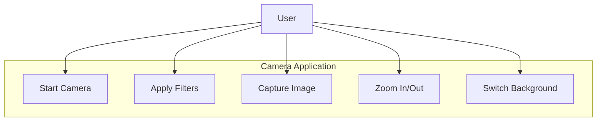
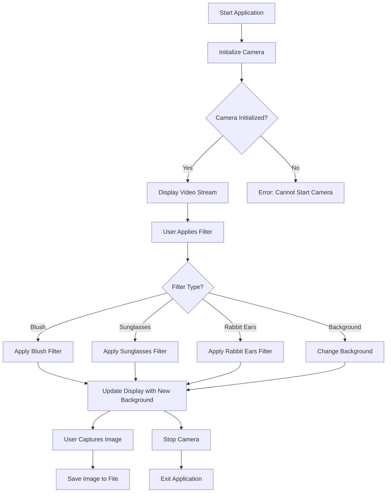
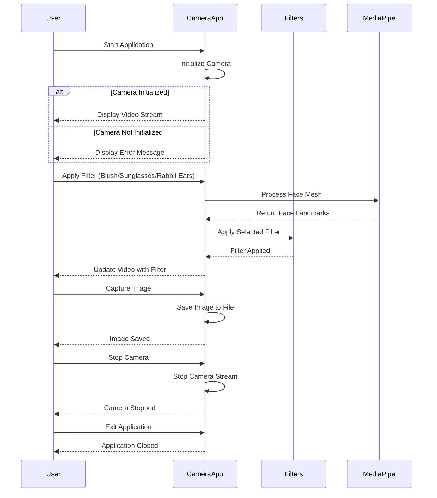
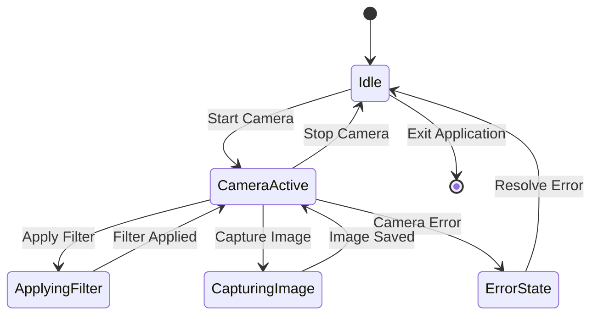
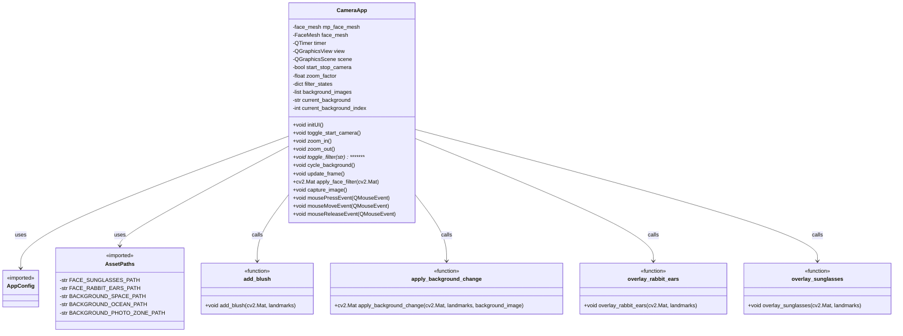

# Face Books

📅 Written at 2025-01-13 02:37:36

## 🚧 Prerequisite

- Download **[resource files](https://drive.google.com/file/d/1H4TsQumP04nv-h8B9Yzaibd0h4C2CMC7/view)** and locate in `camera_filter_app/rsrc` directory

## Showcase

- **[📑 PPT](https://docs.google.com/presentation/d/1GJQGkIuFstN4N1v1FjryqKZ_iLx4-1nZ/edit?usp=sharing&ouid=106474024514069876567&rtpof=true&sd=true)**
- **[📽️ Demo Video](https://drive.google.com/file/d/1CWQXUoqDJuuieDAonLfz1mzXtQSG5oGm/view?usp=sharing)**

## 📂 Directory Structure

tree camera_filter_app  
├── 📂 diagrams  
│&nbsp;&nbsp;&nbsp;&nbsp;├── [1-use_case_diagram.md](diagrams/1-use_case_diagram.md)  
│&nbsp;&nbsp;&nbsp;&nbsp;├── [2-activity_diagram.md](diagrams/2-activity_diagram.md)  
│&nbsp;&nbsp;&nbsp;&nbsp;├── [3-sequence-diagram.md](diagrams/3-sequence-diagram.md)  
│&nbsp;&nbsp;&nbsp;&nbsp;├── [4-state_diagram.md](diagrams/4-state_diagram.md)  
│&nbsp;&nbsp;&nbsp;&nbsp;└── [5-class_diagram.md](diagrams/5-class_diagram.md)  
├── 📂 config  
│&nbsp;&nbsp;&nbsp;&nbsp;├── [app_config.py](config/app_config.py)  
│&nbsp;&nbsp;&nbsp;&nbsp;├── [**init**.py](config/__init__.py)  
│&nbsp;&nbsp;&nbsp;&nbsp;└── [paths.py](config/paths.py)  
├── [filters.py](filters.py)  
├── [**init**.py](__init__.py)  
├── [sendver.py](sendver.py)  
└── 📂 tests  
&nbsp;&nbsp;&nbsp;&nbsp;├── [test_face_detection.ipynb](tests/test_face_detection.ipynb)  
&nbsp;&nbsp;&nbsp;&nbsp;└── [test_face_detection_with_camera.py](tests/test_face_detection_with_camera.py)

## diagrams

---

### Use Case diagram

---

---

### Activity diagram

---

---

### Sequence diagram

---

---

### State diagram

---

---

### Class diagram

## Retrospective

- Unable to write better code due to the use of outdated APIs in the Mediapipe solutions library
