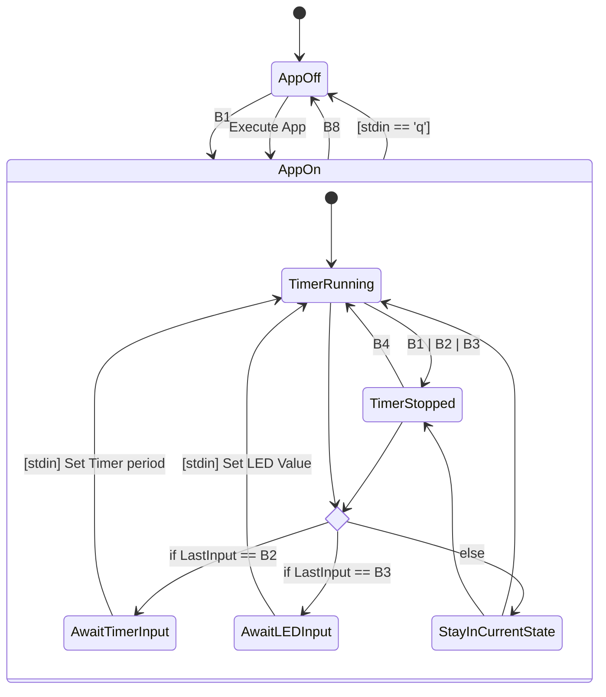

# Kernel Timer Project

📅 Written at 2025-01-03 09:44:20

- [Kernel Timer Project](#kernel-timer-project)
  - [Project Introduction](#project-introduction)
    - [Features](#features)
    - [🎯 Purposes](#-purposes)
    - [🎥 Kernel Timer Demo](#-kernel-timer-demo)
  - [🌐 Project Overview](#-project-overview)
    - [FSM (Finite State Machine)](#fsm-finite-state-machine)
      - [🕹️ Inputs](#️-inputs)
      - [📊 Diagram](#-diagram)
    - [🛠️ Tools](#️-tools)
      - [🧑‍💻 Software](#-software)
        - [🚧 Prerequisite](#-prerequisite)
        - [Setup](#setup)
        - [♾️ Development Pipeline](#️-development-pipeline)
      - [🖥️ Hardware](#️-hardware)
        - [GPIO Pinout Table](#gpio-pinout-table)
    - [📁 Directory Structure](#-directory-structure)
  - [Retrospective](#retrospective)
    - [gpio\_ Legacy API의 한계와 개선점](#gpio_-legacy-api의-한계와-개선점)
    - [디바이스 트리 오버레이(DTS Overlay)의 활용과 가능성](#디바이스-트리-오버레이dts-overlay의-활용과-가능성)

## Project Introduction

- 타이머 기반 LED **제어 응용 프로그램** 및 **디바이스 드라이버**

  - 타이머 주기마다 LED가 반전되는 프로그램으로, 버튼 입력 및 키보드(stdin)를 통해 LED 상태와 타이머 주기를 유연하게 설정 가능

---

### Features

- **장치 등록 및 파일 작업**

  - `register_chrdev()`를 사용한 **캐릭터 디바이스** 등록.
  - `struct file_operations` 구조체를 사용하여 다양한 I/O 작업 처리.

- **파일 작업 함수 정의**

  - `struct file_operations`를 사용하여 장치 파일에 대한 작업(`open()`, `read()`, `write()`, `poll()`, `release()`)을 정의.

- **IOCTL 제어**

  - `ioctl()`을 사용한 타이머 시작/중지(`TIMER_START`, `TIMER_STOP`) 및 타이머 주기 설정(`TIMER_VALUE`) 관리.

- **동적 메모리 할당과 해제**
  장치가 열릴 때마다 동적 메모리 할당(kmalloc())을 통해 각 장치 인스턴스마다 고유한 상태 정보를 저장하여 장치 간 데이터 충돌을 방지.

- **LED 반전 제어**

  - 주기적으로 **LED** 켜짐/꺼짐 반복.
  - 사용자가 지정한 **LED 패턴(값)**에 맞춰 타이머 이벤트 처리.

- **입력 처리 및 타이머 제어**

  - 하드웨어 버튼(Key) 입력 시 **인터럽트** 발생, `keyIsr()` 함수에서 타이머 시작/중지 및 LED 패턴 변경 처리.
  - 표준 입력(`stdin`)을 통한 타이머 주기 및 LED 값 수정, 응용 프로그램 종료.

- **Poll & Blocking I/O**

  - 버튼 입력이 없을 때 **Sleep** 상태로 대기, 키 입력 시 `wake_up` 메커니즘을 통해 처리.
  - `poll()`을 사용하여 비동기적으로 키 입력을 감지하고, 프로그램이 다른 작업을 수행하는 동안에도 키 이벤트 처리.

- **동기화 (Mutex 사용)**

  - 인터럽트 서비스 루틴(ISR)에서 발생할 수 있는 경쟁 조건을 방지하기 위해 `mutex`를 사용하여 **`keyNum`** 값에 대한 안전한 수정 보장.
  - ISR에서 발생하는 여러 인터럽트 간의 충돌을 방지하고, 타이머 및 LED 상태 변경 작업의 일관성 유지.

&nbsp;

---

### 🎯 Purposes

- **디렉터리 구조 설계**

  - `app`, `module`, `include/uapi` 디렉터리로 역할 분리

    **각 디렉터리의 책임 명확화**: (응용프로그램, 커널 모듈, 헤더/공용 정의)

  - **재사용성**과 **확장성**을 높일 수 있는 코드 구조를 채택하여 향후 다른 디바이스나 기능 추가 시 효율적으로 대응 가능.

- **Makefile 구조화 및 위임**

  - 상위 `Makefile`에서 공통 타겟 정의. (**build**, **clean**, **deploy**)  
    하위 `app/Makefile`, `module/Makefile`에서 구체적인 빌드 과정 **위임**
  - “관심사의 분리(Separation of Concerns)”를 통한 **유지보수성** 및 **확장성** 강화.

- **크로스 컴파일 환경 구축**

  - **clang** 컴파일러를 활용하여 임베디드 및 크로스 컴파일 환경에서 빌드 및 배포 용이성 확보.
    - 빠른 컴파일 속도, 정확한 에러 메시지, 더 나은 최적화

- **최소 기능 제품**(Minimum Viable Product (**MVP**))

  - 최소 기능 제품을 우선적으로 구현하여, 빠르게 제품을 검증하고 필요한 기능을 점진적으로 추가가 가능하도록 함.

- **기술 도전(메모리 동적 할당, ioctl, Timer 등)**

  - kmalloc()을 통한 동적 메모리 할당, ioctl(), file operations 를 활용한 드라이버/유저 공간 통신.
  - 커널 타이머를 이용한 주기적 이벤트 관리.
  - Poll/Blocking I/O, 인터럽트, GPIO 제어 등 커널 기능 활용.

&nbsp;

---

### 🎥 Kernel Timer Demo

- [**Watch on Google Drive**](https://drive.google.com/file/d/1WEi8hI9JJjn31yUDXZswBzpSHwIObNlA/view)

&nbsp;

---

## 🌐 Project Overview

### FSM (Finite State Machine)

📝 **참고**: 명시적인 전환이 정의되지 않는 한 상태는 변경되지 않음.

#### 🕹️ Inputs

- Button: B1, B2, B3, B4, B5, B6, B7, B8

| **버튼**  | **기능**                     |
| --------- | ---------------------------- |
| **B1**    | 타이머 중지                  |
| **B2**    | 타이머 주기 변경 (입력 대기) |
| **B3**    | LED 값 변경 (입력 대기)      |
| **B4**    | 타이머 시작                  |
| **B8**    | App 종료                     |
| **stdin** | 사용자 입력                  |

---

#### 📊 Diagram



### 🛠️ Tools

#### 🧑‍💻 Software

- **IDE**: Visual Studio Code (VS Code)
- **Programming Language**: C
- Compiler: **clang**
- NFS Server (Host), NFS Client (Raspberry Pi)

##### 🚧 Prerequisite

- Setup **fish shell** in Raspberry Pi 🔗 prototypes/\_initialization/ubuntu/howto/config-raspberry_pi/\_setup_fish_shell.sh

  ```bash
  #!/usr/bin/env fish

  #### https://software.opensuse.org/download.html?project=shells%3Afish%3Arelease%3A3&package=fish
  echo 'deb http://download.opensuse.org/repositories/shells:/fish:/release:/3/Debian_12/ /' | sudo tee /etc/apt/sources.list.d/shells:fish:release:3.list
  curl -fsSL https://download.opensuse.org/repositories/shells:fish:release:3/Debian_12/Release.key | gpg --dearmor | sudo tee /etc/apt/trusted.gpg.d/shells_fish_release_3.gpg > /dev/null


  # Install the Fish shell
  sudo apt update && sudo apt install -y fish


  # ❗ Change the default shell to Fish
  sudo chsh -s $(which fish) $USER
  ```

##### Setup

- **❗ Ensure the kernel architecture is ARM 64-bit.**

  ```bash
  #!/usr/bin/env fish
  ## Kernel architecture
  uname -m
  # >> arm64

  ## Userland architecture
  # dpkg-architecture --query DEB_HOST_ARCH
  #   >> arm64
  ```

- Setup with **Automation script**

  ```bash
  #!/usr/bin/env fish

  ##### 👆 User-specific settings

  ### Set Path of Raspberry Pi kernel source and Download
  mkdir -p $HOME/repos/kernels
  cd $HOME/repos/kernels

  # 📝 In Host, In `$HOME/repos/kernels` directory (🖥️ in the case of Raspberry Pi 4, 64-bit)
  git clone --depth=1 --single-branch https://github.com/raspberrypi/linux raspberry_pi
  cd raspberry_pi


  ### Set Variables
  # we recommend passing a number 1.5x your number of processors. 🔗 https://www.raspberrypi.com/documentation/computers/linux_kernel.html#native-build
  set jobs_core_n (math (nproc)" * 1.5")
  set -gx kernel_release (make ARCH=arm64 CROSS_COMPILE=aarch64-linux-gnu- kernelrelease)
  set -gx kernel_image_name "kernel8-kernel_timer_config.img"  # Image name to set

  set -gx KERNEL_CONFIG_LOCALVERSION -v8-synergy_hub
  set -gx nfs_server_root_dir /nfs
  set -gx nfs_server_raspberry_pi_kernel_dir $nfs_server_root_dir/kernels/raspberry_pi
  mkdir -p $nfs_server_raspberry_pi_kernel_dir
  set -gx nfs_client_root_dir /mnt/host
  set -gx nfs_client_raspberry_pi_kernel_dir $nfs_client_root_dir/kernels/raspberry_pi


  set -gx raspberry_pi_host r-pi.local
  sudo cp -r /mnt/lib/modules/$(uname -r) /lib/modules/


  # Set variables for Deploy (Host is NFS server, RasBerry pi is NFS Client)
  set nfs_host_pi_kernel "/nfs/kernels/raspberry_pi"
  mkdir -p $nfs_host_pi_kernel
  set nfs_client_pi_kernel "/mnt/host/kernels/raspberry_pi"


  ##### 👆 Pipeline
  ### Install the build dependencies
  sudo apt install -y bc bison flex libssl-dev make
  # Install the build dependencies for Cross-compiling the kernel
  sudo apt install -y libc6-dev libncurses5-dev
  # Install the 64-bit toolchain for Cross-compiling the kernel
  sudo apt install -y crossbuild-essential-arm64


  ### Build configuration

  make ARCH=arm64 CROSS_COMPILE=aarch64-linux-gnu- bcm2711_defconfig

  ## 🪶🏷️ Customize the kernel version using LOCALVERSION
  set CONFIG_FILE .config

  set TMP_FILE (mktemp)

  awk -v new_local_version=$KERNEL_CONFIG_LOCALVERSION '{
      if ($1 ~ /^CONFIG_LOCALVERSION=/) {
          print "CONFIG_LOCALVERSION=\"" new_local_version "\""
      } else {
          print $0
      }
  }' $CONFIG_FILE > $TMP_FILE

  mv $TMP_FILE $CONFIG_FILE


  ### Build
  # 📝 In this project the device tree is not modified so only Image and modules need to be built
  make ARCH=arm64 CROSS_COMPILE=aarch64-linux-gnu- Image modules -j{$jobs_core_n}
  # make ARCH=arm64 CROSS_COMPILE=aarch64-linux-gnu- Image modules dtbs -j{$jobs_core_n}

  ## If boot media is mounted
  # sudo env PATH=$PATH make ARCH=arm64 CROSS_COMPILE=aarch64-linux-gnu- INSTALL_MOD_PATH=mnt/root modules_install -j{$jobs_core_n}


  ##### 👆 Deploy Image
  ### Install the 64-bit kernel
  cp arch/arm64/boot/Image /nfs/kernels/raspberry_pi/$kernel_image_name
  ssh $raspberry_pi_host "sudo cp $nfs_client_raspberry_pi_kernel_dir/$kernel_image_name /boot/firmware/"

  ### Install the kernel modules
  make -j$jobs_core_n ARCH=arm64 CROSS_COMPILE=aarch64-linux-gnu- INSTALL_MOD_PATH=$nfs_server_raspberry_pi_kernel_dir modules_install
  ssh $raspberry_pi_host "sudo cp -r $nfs_client_raspberry_pi_kernel_dir/lib/modules/$kernel_release/ /lib/modules/"

  🪶🏷️ Set Kernel image to be Booted
  set CONFIG_FILE /boot/firmware/config.txt
  set TMP_FILE (mktemp)

  # Use awk to ensure the kernel line is updated correctly
  awk -v new_kernel_image=$kernel_image_name '
  BEGIN { updated = 0 }
  {
      if ($1 ~ /^kernel=/) {
          # Update the kernel= line, even if it is empty
          print "kernel=" new_kernel_image
          updated = 1
      } else {
          print $0
      }
  }
  END {
      if (updated == 0) {
          # If no kernel= line was found, add it at the end
          print "kernel=" new_kernel_image
      }
  }' $CONFIG_FILE > $TMP_FILE

  # Apply original ownership and permissions to the temporary file
  set OWNER (stat --format='%u:%g' $CONFIG_FILE)
  set PERMISSIONS (stat --format='%a' $CONFIG_FILE)

  sudo chown $OWNER $TMP_FILE
  sudo chmod $PERMISSIONS $TMP_FILE

  # Overwrite the original file with the updated content
  sudo mv $TMP_FILE $CONFIG_FILE

  # Output result
  echo "Updated kernel configuration in $CONFIG_FILE to:"
  echo "kernel=$KERNEL_IMAGE"
  ```

- 📝 Note that:

  - Before booting with a custom kernel image, ensure that the modules are installed in `/lib/modules/$kernel_release`.
  - Or, if the system has already booted without the required modules:
    - Install the kernel's modules.
    - ```bash
      sudo depmod -a && sudo reboot
      ```

  ⚠️ Otherwise, the error occurs on Raspberry Pi, and the display shows a black screen (🚣 **but SSH can still be connected**):

  ```plaintxt
  Mounting proc-sys-fs-binfmt_misc.mou…trary Executable File Formats File System...
  [FAILED] Failed to mount proc-sys-fs-binfmt_m…bitrary Executable File Formats File System.
  [FAILED] Failed to start systemd-binfmt.service - Set Up Additional Binary Formats.
  [*     ] (1 of 3) Job plymouth-quit-wait.service/start running (1min 28s / no limit)
  [   ***] (2 of 3) Job dev-dri-card0.device/start running (1min 26s / 1min 30s)
  [ ***  ] (3 of 3) Job dev-dri-renderD128.device/start running (1min 23s / 1min 30s)
  ```

&nbsp;

---

##### ♾️ Development Pipeline

**In "kernel_timer" directory**, Run

- make
  - build
    - build-app
    - build-module
  - clean
    - clean-app
    - clean-module
  - deploy
    - deploy-app
    - deploy-module

📝 Note that ⚖️ **default deploy directory** is "DEPLOY_DIR := /nfs/drivers" in **Makefile**

&nbsp;

#### 🖥️ Hardware

- **Raspberry Pi 4B**

- [**RPi GPIO Breakout Expansion Board** + **Ribbon Cable** + **Assembled T Type GPIO Adapter FC40 40pin Flat Ribbon Cable** (for Raspberry Pi B+ Kit)](https://www.amazon.com/dp/B08D3S6FGH?ref_=cm_sw_r_cp_ud_dp_J1TGSNSHCBW76PJJ9VF3&newOGT=1)

- [NEWTC 🔪 LEDs 🔪 **AM-TL8**](https://www.devicemart.co.kr/goods/view?no=6772)

  - [Manual](https://www.newtc.co.kr/dpshop/bbs/board.php?bo_table=m45&wr_id=41&sfl=&stx=&sst=wr_hit&sod=desc&sop=and&page=8)
    - 5V

- [NEWTC 🔪 Buttons 🔪 **AM-TS8**](https://www.devicemart.co.kr/goods/view?no=11701)
  - [Manual](https://newtc.co.kr/dpshop/bbs/board.php?bo_table=m41&wr_id=48&page=11)
    - 5V

&nbsp;

##### GPIO Pinout Table

- ⚪: Available (Not Configured)
- 🟢: Assigned with Configuration
- 🎛️: Assigned with Configuration but Not physically connected

| GPIO Pins             | GPIO Pins Status | GPIO Pins Status | GPIO Pins            |
| --------------------- | ---------------- | ---------------- | -------------------- |
| 01-3.3V               | ⚪                | 🟢                | 02-5V                |
| 03-GPIO02 (SDA1)      | ⚪                | ⚪                | 04-5V                |
| 05-GPIO03 (SCL1)      | ⚪                | 🟢                | 06-GND               |
| 07-GPIO04             | ⚪                | 🟢 (USB to TTL)   | 08-GPIO14 (TXD)      |
| 09-GND                | ⚪                | 🟢 (USB to TTL)   | 10-GPIO15 (RXD)      |
| 11-GPIO17 (PWM0)      | 🟢 (Button 2)     | 🟢 (Button 3)     | 12-GPIO18 (PCM_CLK)  |
| 13-GPIO27 (PWM1)      | ⚪                | ⚪                | 14-GND               |
| 15-GPIO22             | 🟢 (Button 7)     | 🟢 (Button 8)     | 16-GPIO23            |
| 17-3.3V               | ⚪                | ⚪                | 18-GPIO24            |
| 19-GPIO10 (SPI0 MOSI) | 🟢 (LED 5)        | ⚪                | 20-GND               |
| 21-GPIO09 (SPI0 MISO) | 🟢 (LED 4)        | ⚪                | 22-GPIO25            |
| 23-GPIO11 (SPI0 SCLK) | 🟢 (LED 6)        | 🟢 (LED 3)        | 24-GPIO08 (CE0)      |
| 25-GND                | ⚪                | 🟢 (LED 2)        | 26-GPIO07 (CE1)      |
| 27-GPIO00 (I2C0 SDA)  | ⚪                | ⚪                | 28-GPIO01 (I2C0 SCL) |
| 29-GPIO05             | ⚪                | ⚪                | 30-GND               |
| 31-GPIO06             | 🟢 (LED 1)        | 🟢 (LED 7)        | 32-GPIO12            |
| 33-GPIO13             | 🟢 (LED 8)        | ⚪                | 34-GND               |
| 35-GPIO19             | 🟢 (Button 4)     | 🟢 (Button 1)     | 36-GPIO16            |
| 37-GPIO26             | ⚪                | 🟢 (Button 5)     | 38-GPIO20            |
| 39-GND                | ⚪                | 🟢 (Button 6)     | 40-GPIO21            |

&nbsp;

---

### 📁 Directory Structure

├── 📂 **app**  
│&nbsp;&nbsp;&nbsp;&nbsp;├── [Makefile](app/Makefile)  
│&nbsp;&nbsp;&nbsp;&nbsp;└── 📂 **src**  
│&nbsp;&nbsp;&nbsp;&nbsp;&nbsp;&nbsp;&nbsp;&nbsp;├── 📂 **include**  
│&nbsp;&nbsp;&nbsp;&nbsp;&nbsp;&nbsp;&nbsp;&nbsp;└── [kernel_timer_app.c](app/src/kernel_timer_app.c)  
├── 📂 **build**  
├── 📂 **include**  
│&nbsp;&nbsp;&nbsp;&nbsp;└── 📂 **uapi**  
│&nbsp;&nbsp;&nbsp;&nbsp;&nbsp;&nbsp;&nbsp;&nbsp;└── [ledkey_ioctl.h](include/uapi/ledkey_ioctl.h)  
├── [Makefile](Makefile)  
├── 📂 **module**  
│&nbsp;&nbsp;&nbsp;&nbsp;├── [Makefile](module/Makefile)  
│&nbsp;&nbsp;&nbsp;&nbsp;└── 📂 **src**  
│&nbsp;&nbsp;&nbsp;&nbsp;&nbsp;&nbsp;&nbsp;&nbsp;├── 📂 **include**  
│&nbsp;&nbsp;&nbsp;&nbsp;&nbsp;&nbsp;&nbsp;&nbsp;└── [kernel_timer_dev.c](module/src/kernel_timer_dev.c)  
└── [pipeline.fish](pipeline.fish)

&nbsp;

---

## Retrospective

### gpio\_ Legacy API의 한계와 개선점

- ❔ 현재 프로젝트에서 사용한 GPIO API의 평가와 대안 탐색

  - **기존 방식: gpio\_ 접두사 함수 사용**:

    - 프로젝트에서 기존에 `gpio_` 접두사를 사용하는 레거시 API를 활용.
    - GPIO 핀 번호를 직접 관리하며, 코드가 복잡해지고 유지보수에 어려움 발생.
    - 핀 사용 추적이 어려워 충돌 및 불필요한 요청 해제 문제가 발생.

  - **Legacy style 설계의 문제점**:

    - GPIO 핀 번호를 직접 관리해야 하는 구조.
    - 코드 가독성과 유지보수성에 대한 부담 증가.

  - **소비자(Consumer) 개념 부재**:

    - 특정 GPIO 핀을 누가 사용 중인지 명확히 알 수 없는 구조.
    - 핀 충돌 및 불필요한 요청 해제 발생 가능.

  - **멀티스레드 환경에서의 안정성 부족**:

    - 동시 접근 시 충돌 가능성 증가.

&nbsp;

➡️ **향후 개선 방향: gpiod\_ API 도입**

- **디스크립터 기반 설계**:

  - GPIO 핀과 소비자 간 명시적 연결 제공.
  - 핀 사용 추적 및 충돌 방지 가능.

- **코드 추상화 및 간결화**:

  - 핀 번호 대신 디스크립터 사용으로 코드 가독성 향상.
  - 하드웨어 독립적 설계로 유지보수성 강화.

- **멀티스레드 환경에서의 안정성 보장**:

  - 시스템 신뢰성 향상을 위한 기반 제공.

&nbsp;

❔ **Reference**

- 🔗 [GPIO Descriptor Consumer Interface](https://www.kernel.org/doc/html/latest/driver-api/gpio/consumer.html)

  > The gpio\_ prefix is used for the legacy interface. No other function in the kernel should use these prefixes. The use of the legacy functions is **strongly discouraged**, new code should use <linux/gpio/consumer.h> and descriptors exclusively.

&nbsp;

---

### 디바이스 트리 오버레이(DTS Overlay)의 활용과 가능성

- ❔ 디바이스 트리 오버레이의 실무 적용과 향후 방향성

  - **기존 방식: 디바이스 트리 미사용**:

    - 현재 프로젝트에서 디바이스 트리를 사용하지 않고, LED와 버튼 제어를 Legacy API(`gpio_` 접두사)를 통해 구현.
    - GPIO 핀 번호를 직접 관리하며, 디바이스 트리의 설정 변경 없이 단순 제어 작업 수행.

  - **디바이스 트리 오버레이 사용 시 기대되는 장점**:

    - **동적 하드웨어 설정 가능**:
      - 커널 전체를 재빌드하지 않고 오버레이를 통해 설정 변경 가능.
    - **프로토타이핑과 테스트의 효율성**:
      - 반복적으로 하드웨어 구성을 변경하는 초기 개발 단계에서 시간을 절약 가능.
    - **모듈형 설계 지원**:
      - 하드웨어가 모듈화된 경우 디바이스 트리 오버레이를 통해 확장 가능한 하드웨어 구성을 지원 가능.

&nbsp;

➡️ **향후 개선 방향: 디바이스 트리 오버레이 도입 가능성**

- **테스트 환경에서의 유연성 확보**:

  - 다양한 하드웨어 설정을 테스트해야 하는 경우 효율적인 대안 제공.

- **장기적으로 모듈화된 시스템 설계 지원**:
  - 향후 프로젝트에서 모듈형 하드웨어 확장을 염두에 두고 디바이스 트리 오버레이의 도입 가능성 검토.

&nbsp;

❔ **Reference**

- 🔗 [Device Tree Overlays Documentation](https://docs.kernel.org/devicetree/overlay-notes.html)
