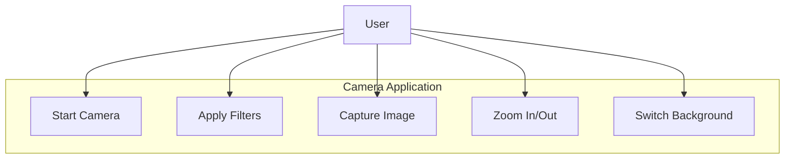
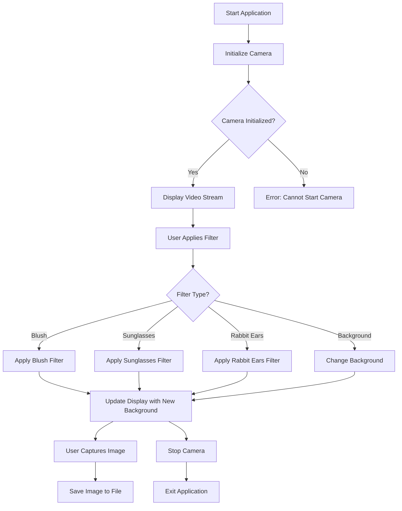
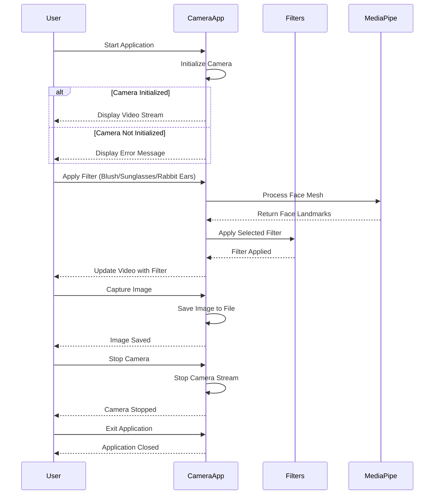
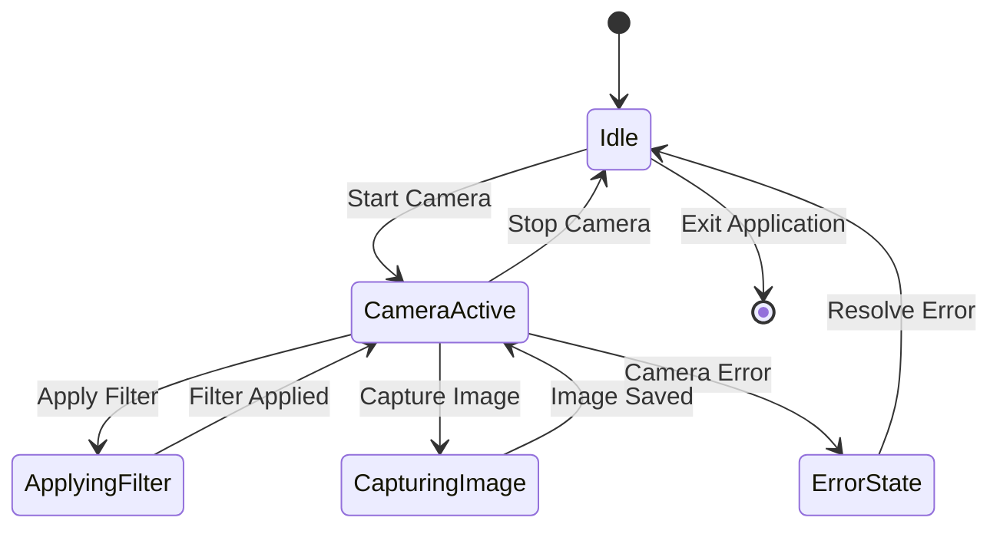
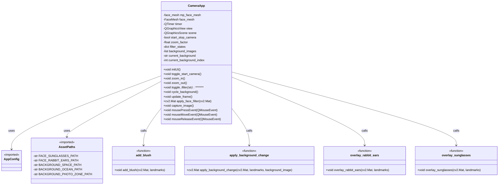

# Face Books (인생 네컷)

📅 수행 기간: 2024.09.02 ~ 2024.09.06

- [Face Books (인생 네컷)](#face-books-인생-네컷)
  - [Project Introduction](#project-introduction)
    - [Features](#features)
    - [🎯 Purposes](#-purposes)
    - [Showcase](#showcase)
  - [🌐 Project Overview](#-project-overview)
    - [🚧 Prerequisite](#-prerequisite)
    - [📊 System Workflow](#-system-workflow)
      - [Use Case diagram](#use-case-diagram)
      - [Activity diagram](#activity-diagram)
      - [Sequence diagram](#sequence-diagram)
      - [State diagram](#state-diagram)
      - [Class diagram](#class-diagram)
    - [🛠️ Tools](#️-tools)
      - [🧑‍💻 Software](#-software)
      - [🖥️ Hardware](#️-hardware)
    - [📁 Directory Structure](#-directory-structure)
    - [📖 Key Components and Implementation](#-key-components-and-implementation)
  - [📁 Python Files](#-python-files)
    - [🗄️ **filter.py**](#️-filterpy)
      - [function: overlay\_rabbit\_ears(frame, landmarks)](#function-overlay_rabbit_earsframe-landmarks)
  - [❔ 참고사항](#-참고사항)
  - [Retrospective](#retrospective)
    - [📌 Key Learnings and Improvements](#-key-learnings-and-improvements)

---

## Project Introduction

### Features

- 실시간 얼굴 랜드마크 감지를 통한 가상 필터 오버레이.
- 토끼 귀, 선글라스, 블러쉬 등의 창의적 필터 제공.
- 카메라 화면 캡처 및 촬영된 사진 카카오톡 공유 기능.

### 🎯 Purposes

- 사용자에게 재미있고 창의적인 사진 촬영 경험 제공.

### Showcase

- **[📑 PPT](https://docs.google.com/presentation/d/1GJQGkIuFstN4N1v1FjryqKZ_iLx4-1nZ/edit?usp=sharing&ouid=106474024514069876567&rtpof=true&sd=true)**
- **[📽️ Demo Video](https://drive.google.com/file/d/1CWQXUoqDJuuieDAonLfz1mzXtQSG5oGm/view?usp=sharing)**

---

## 🌐 Project Overview

### 🚧 Prerequisite

- Download **[resource files](https://drive.google.com/file/d/1H4TsQumP04nv-h8B9Yzaibd0h4C2CMC7/view)** and locate in `camera_filter_app/rsrc` directory

### 📊 System Workflow

#### Use Case diagram

&nbsp;

---

#### Activity diagram

&nbsp;

---

#### Sequence diagram

&nbsp;

---

#### State diagram

&nbsp;

---

#### Class diagram

---

&nbsp;

### 🛠️ Tools

#### 🧑‍💻 Software

- **OpenCV**: 얼굴 인식 및 랜드마크 추적 구현.
- **MediaPipe**: 얼굴 메쉬 생성 및 탐지.
- **PySide6**: GUI 설계 및 사용자 인터페이스 구현.
- **Flask**: 로컬 서버 구축 및 카카오톡 연동.

#### 🖥️ Hardware

- **웹캠**: 얼굴 탐지 및 영상 처리.

&nbsp;

---

### 📁 Directory Structure

tree camera_filter_app  
├── 📂 diagrams  
│&nbsp;&nbsp;&nbsp;&nbsp;├── [1-use_case_diagram.md](diagrams/1-use_case_diagram.md)  
│&nbsp;&nbsp;&nbsp;&nbsp;├── [2-activity_diagram.md](diagrams/2-activity_diagram.md)  
│&nbsp;&nbsp;&nbsp;&nbsp;├── [3-sequence-diagram.md](diagrams/3-sequence-diagram.md)  
│&nbsp;&nbsp;&nbsp;&nbsp;├── [4-state_diagram.md](diagrams/4-state_diagram.md)  
│&nbsp;&nbsp;&nbsp;&nbsp;└── [5-class_diagram.md](diagrams/5-class_diagram.md)  
├── 📂 config  
│&nbsp;&nbsp;&nbsp;&nbsp;├── [app_config.py](config/app_config.py)  
│&nbsp;&nbsp;&nbsp;&nbsp;└── [paths.py](config/paths.py)  
├── [filters.py](filters.py)  
├── [main.py](main.py)  
└── 📂 tests

&nbsp;

---

### 📖 Key Components and Implementation

- **Library Investigation**

  - PySide6, OpenCV, MediaPipe Solutions 등 프로젝트에 필요한 라이브러리 조사.

- **MediaPipe Solutions**

  - MediaPipe BlazeFace 및 Face Mesh V2 모델 조사 및 활용.
  - 얼굴 탐지와 랜드마크 데이터 활용 최적화.

- **Rabbit Ear Filter Implementation**

  - 얼굴 랜드마크 기반 필터 오버레이.
  - 알파 블렌딩을 적용하여 자연스러운 결과 구현.

- **Code Refactoring**

  - 모듈화와 함수화로 코드 가독성 개선.
  - 중복 코드 제거 및 데이터 처리 최적화.

- **Diagram Design**

  프로젝트 구조와 알고리즘을 시각화하기 위해 다음 다이어그램을 작성:

  - Use Case Diagram
  - Activity Diagram
  - Sequence Diagram
  - State Diagram
  - Class Diagram

&nbsp;

---

## 📁 Python Files

### 🗄️ **[filter.py](filters.py)**

#### function: overlay_rabbit_ears\(frame, landmarks\)

❔ 주요 기능

- MediaPipe Face Mesh의 얼굴 랜드마크를 활용하여 프레임 위에 토끼 귀 이미지를 오버레이.
- 이마 랜드마크를 기준으로 토끼 귀 이미지를 배치하고 알파 블렌딩을 통해 자연스럽게 표현.

&nbsp;

❔ **알고리즘 구성**

1. **이미지 및 입력 초기화**

   - 토끼 귀 이미지를 로드하고 입력 프레임의 크기를 확인.
   - 이미지 로드 실패 시 `FileNotFoundError` 예외 발생.

2. **토끼 귀 위치 계산**

   - 이마 랜드마크의 정규화된 좌표를 픽셀 좌표로 변환.
   - 이미지 중심이 이마 좌표와 일치하도록 배치.

3. **프레임 경계 조정**

   - 프레임 경계를 초과하지 않도록 좌표를 보정.

4. **알파 블렌딩 처리**
   - 토끼 귀 이미지의 알파 채널을 활용해 프레임과 자연스럽게 합성.

&nbsp;

❔ **매개변수**

- `frame`: 입력 프레임 (OpenCV Mat 형식).
- `landmarks`: 얼굴 랜드마크 리스트.

&nbsp;

❔ **반환값**

- 없음 (`None`). 프레임이 직접 수정됨.

&nbsp;

❔ **예외 처리**

- 토끼 귀 이미지 로드 실패 시 `FileNotFoundError` 예외 발생.

&nbsp;

## ❔ 참고사항

- MediaPipe Face Mesh의 랜드마크는 정규화된 값으로 제공되므로, 프레임 크기에 맞게 변환 필요.

&nbsp;

---

## Retrospective

### 📌 Key Learnings and Improvements

- MediaPipe solutions 를 사용할 때 구 버전의 API 를 사용하여, VS Code 의 Intellisense 의 도움을 받지 못하여 좀 더 나은 코드를 작성하지 못함.
